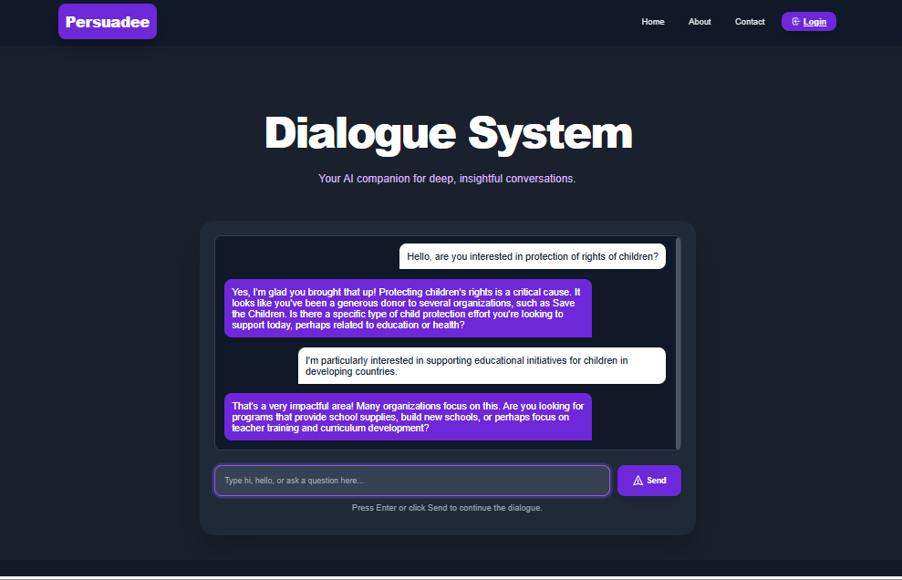

# 🧠 Persuasion Dialogue System for Social Good

## 📌 Overview

This project focuses on building an AI-powered dialogue system that generates **persuasive responses** to encourage users to take actions for social good, such as:

* Donating to charities
* Promoting environmental awareness
* Supporting social causes

The system leverages the **PersuasionForGood Corpus** and fine-tunes a **GPT-Neo language model** using **Reinforcement Learning with Human Feedback (RLHF)** to produce context-aware and ethically persuasive conversations.

---

## 🎯 Objective

To develop an intelligent conversational agent that:

* Understands user input in a dialogue setting
* Generates persuasive, human-like responses
* Encourages positive behavioral change for societal benefit

---

## 🧾 Dataset

* **Source:** PersuasionForGood Corpus
* **Structure:**

  * `B2`: Dialogue ID
  * `B4`: Role

    * `0` → Persuader
    * `1` → Persuadee
  * `Turn`: Turn index in conversation
  * `Unit`: Sentence/utterance


---

## ⚙️ Tech Stack

* Python
* Hugging Face Transformers
* GPT-Neo
* Streamlit (for UI)
* Pandas (data handling)

---

## 🧠 Model Pipeline

1. Data preprocessing from dialogue corpus
2. Fine-tuning GPT-Neo on persuasive conversations
3. Applying RLHF for improved response quality
4. Deployment via Streamlit interface

---

## 🚀 Demo Application


```python
import streamlit as st
from transformers import pipeline

@st.cache_resource
def load_model():
    return pipeline("text-generation", model="./neo_persuasion_finetuned")

generator = load_model()

st.title("Persuasive Text Generator")

prompt = st.text_input("Enter user statement:")

if prompt:
    response = generator(
        prompt,
        max_length=80,
        do_sample=True,
        temperature=0.8
    )
    
    st.write("**AI Response:**")
    st.write(response[0]['generated_text'])
```

---

## 💡 Features

* Context-aware persuasive dialogue generation
* Human-like conversational tone
* Adjustable creativity using temperature sampling
* Lightweight UI for real-time interaction

---

## 📊 Future Improvements

* Multilingual persuasion support
* Explainable AI for transparency in persuasion
* Bias mitigation in generated responses
* Integration with real-world social platforms

---

## ⚠️ Ethical Considerations

* Use persuasion responsibly and transparently
* Avoid manipulation or coercion
* Ensure fairness and minimize bias
* Keep human oversight in critical scenarios

---

## 📂 How to Run

```bash
pip install -r requirements.txt
streamlit run app.py
```

